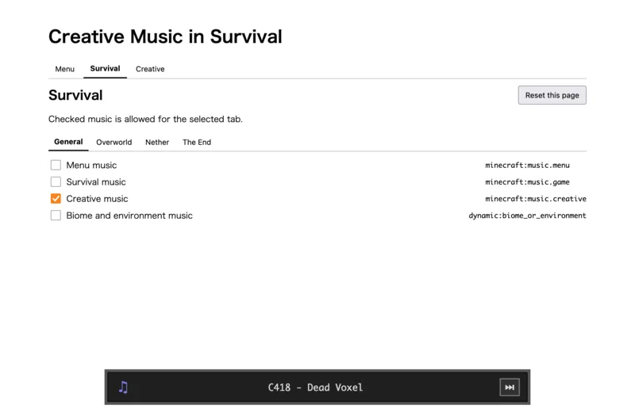
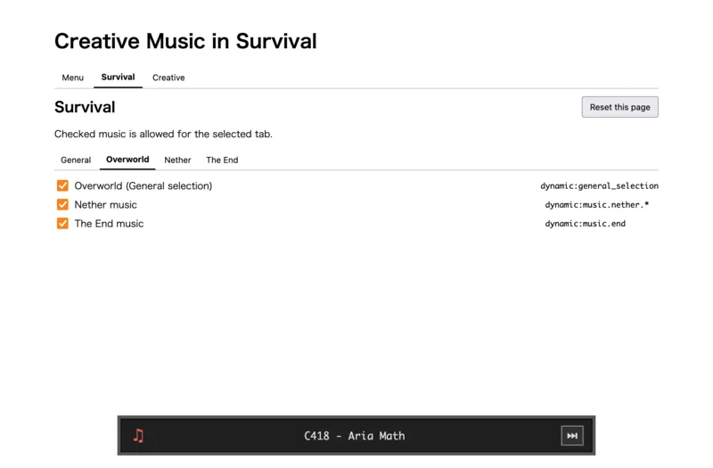

# Creative Music in Survival

Choose which Minecraft music can play in each game mode and dimension.

## Usage

1. Start Minecraft.
2. Open `http://127.0.0.1:56001/`.
3. Select a game mode and dimension, then choose the music.

Changes are applied immediately. **Reset this page** restores the selected tab's default settings.

The bottom player shows the current track. Use the next button to reroll it.(26.1.2 or later only.)

